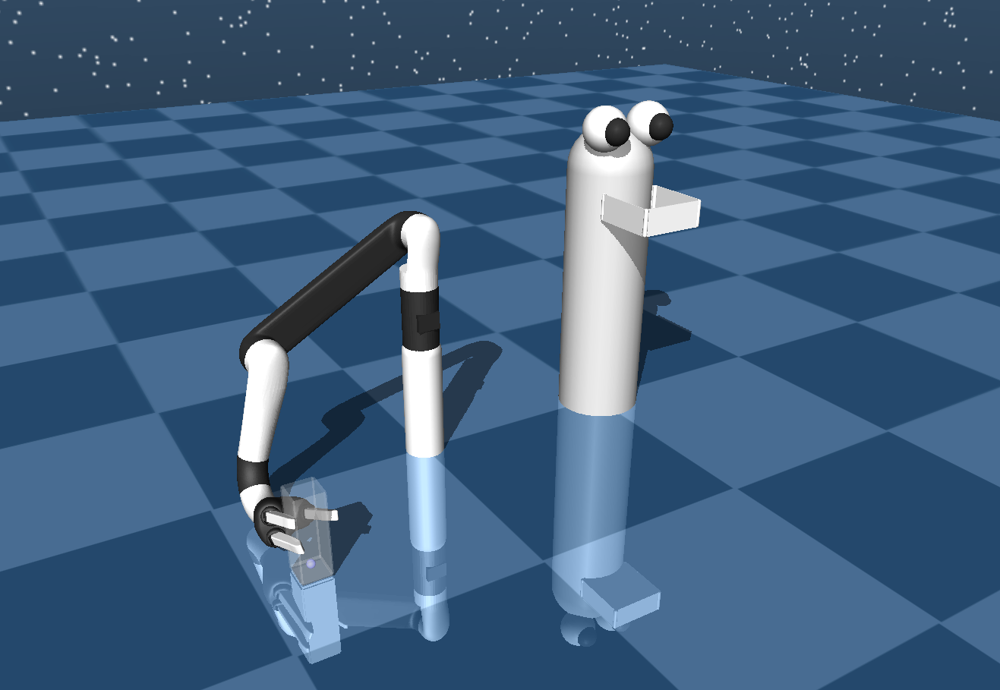

# Adaptive Jaco Robotic Arm: A PPO and Hybrid Algorithm Approach

Welcome to the repository of the Adaptive Jaco Robotic Arm project. This initiative leverages the Proximal Policy Optimization (PPO) and a novel Hybrid algorithm to train a Jaco robotic arm to assist individuals with disabilities. The hybrid algorithm is a fusion of PPO and genetic algorithm, designed to enhance the learning and adaptability of the robotic arm.

## Project Overview

The goal of this project is to create a robotic assistance system where a Jaco robotic arm can autonomously grab a bottle of water and pour it into a simulated face, effectively simulating the act of assisting disabled individuals in drinking water. The project stands as a testament to the advancements in robotic assistance and the potential for robotics to aid in personal care.


In this visual representation, you can see the simulated environment. It features the Jaco robotic arm delicately gripping a glass of water, symbolized by the small blue sphere. The primary objective within this simulation is to execute a precise pouring maneuver, with the challenge of avoiding any spills, as the aim to satisfy the thirst of our character, affectionately named Rolly, by directing the liquid into his awaiting mouth.

### Technologies Used

- **Python**: The primary programming language used for developing the scripts.
- **TensorFlow**: Leveraged for building and training the neural network models.
- **Gym**: Utilized for creating the simulation environment for the Jaco robotic arm.
- **NumPy & SciPy**: Employed for numerical computations and scientific computing, respectively.

### Installation

To set up the necessary environment for running the project, install the required Python libraries using the following command:
```bash
pip install gym==0.10.9 tensorflow==0.15 numpy==1.15.2 scipy==1.5
```

### Usage

Run the MAIN.py script to initiate the training process. The script accepts several parameters that influence the training dynamics. Edit the following line in MAIN.py to customize the training:
```bash
main(env_name='Jaco-v1', num_episodes=50000, gamma=0.99, lam=0.95, epsilon=0.2, mult_neuronas=20, batch_size=20, log_name='/Jaco/m1', policy_std=0)
```

### Parameters Description (with default values)

- env_name ('Jaco-v1'): Specifies the simulation environment for the Jaco robotic arm.
- num_episodes (50000): Defines the total number of episodes for the training session.
- gamma (0.99): The discount factor used in the reward mechanism, influencing the agent's focus on short-term vs. long-term rewards.
- lam (0.95): The lambda parameter in the Generalized Advantage Estimation (GAE), determining the trade-off between bias and variance in the estimation.
- epsilon (0.2): Represents the clipping parameter in the PPO algorithm, helping to maintain the policy's stability.
- mult_neuronas (20): Multiplier for determining the number of neurons in each layer of the neural network.
- batch_size (20): The number of samples in each batch during the training process, influencing the gradient descent optimization.
- log_name ('/Jaco/m1'): The directory path where the training logs will be stored.
- policy_std (0): The standard deviation of the policy, affecting the exploration strategy of the agent.

### Results

[Watch the Video](https://www.youtube.com/watch?v=your_video_id)
In this video blablabla...